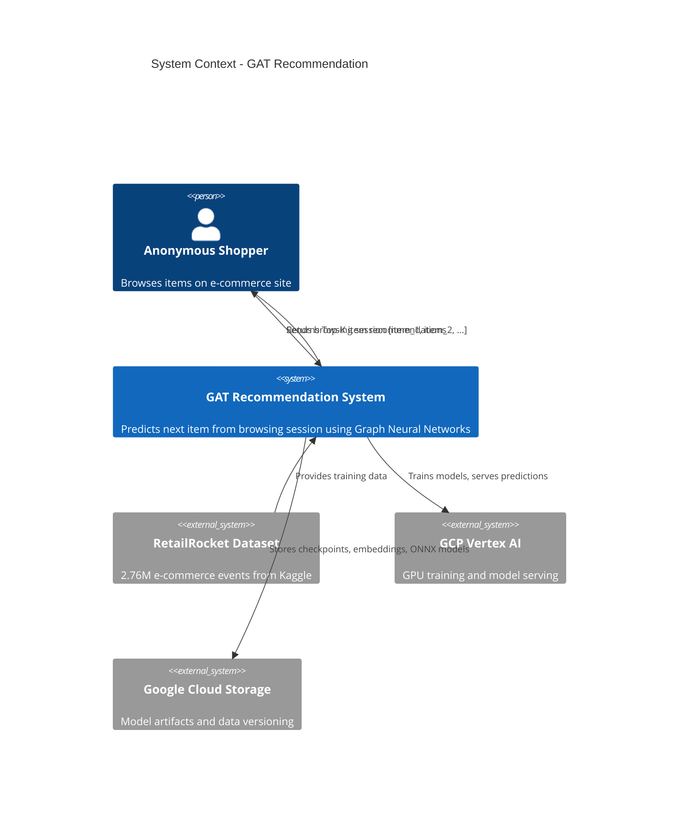

# C1: System Context

## What Problem Does This Solve?

A first-time visitor lands on an e-commerce site. No account. No purchase history. No cookies from previous visits. The only signal you have is what they just browsed: the last 3 to 10 items they clicked on.

**The question:** Given only a browsing session, what should you recommend next?

Traditional recommendation systems (collaborative filtering, matrix factorization) need user history. They fail on anonymous visitors. This system solves that by treating the problem as a graph problem.

**The core idea:** If items A and B frequently appear together in browsing sessions, they are related. Build a graph of these co-occurrences. Then use Graph Neural Networks to learn item relationships from the graph structure and predict the next item.

## System Context Diagram

## Actors and Boundaries

| Actor | Role | Interface |
|-------|------|-----------|
| Anonymous Shopper | Browses items, receives recommendations | REST API (`POST /predict`) |
| Data Scientist | Trains models, runs experiments | CLI (`make train`, `dvc repro`) |
| ML Engineer | Deploys and monitors models | Makefile + GCP scripts |
| RetailRocket Dataset | Source of raw e-commerce events | CSV download from Kaggle |
| GCP Vertex AI | GPU compute for training and serving | Docker containers |

## Constraints

1. **No user identity.** Visitors are anonymous. The system must work with session-level signals only.
2. **Cold start.** New items with no co-occurrence history get no edges in the graph. The system handles this by falling back to embedding similarity.
3. **Budget.** $300 across multiple projects. The full Graph Transformer with FFN layers was estimated at $1,880 for 100 epochs. That was a non-starter. The optimized variant (no FFN) costs about $21 for 100 epochs and actually performs better.
4. **Latency.** Recommendations must be fast enough for real-time serving. Target: under 50ms P50. Achieved 5.5ms with ONNX.
5. **Data leakage prevention.** Train/test splits must be temporal (not random) with blackout periods to simulate real deployment.

## Key Result

38.28% Recall@10 on RetailRocket. The correct next item appears in the top 10 recommendations 38% of the time. This is 2.6x better than the GraphSAGE baseline.

## Documentation Map

| Document | What It Covers |
|----------|----------------|
| [C2: Containers](C2_CONTAINER.md) | Major runtime containers and technology choices |
| [C3: Components](C3_COMPONENT.md) | Internal components within each container |
| [C4: Code](C4_CODE.md) | Key code walkthroughs with actual snippets |
| [Data Pipeline](../DATA_PIPELINE.md) | How raw events become a graph |
| [Models](../MODELS.md) | Model architectures with all parameters |
| [Experiments](../EXPERIMENTS.md) | Results, ablations, and the budget story |
| [Deployment](../DEPLOYMENT.md) | Serving infrastructure and monitoring |
| [Parameters](../PARAMETERS.md) | Complete parameter reference |
