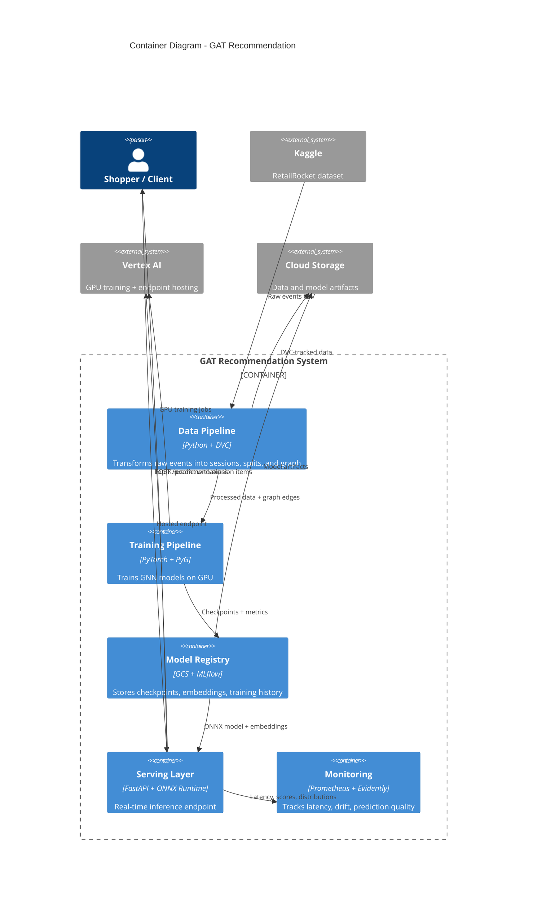

# C2: Container Diagram

This document shows the major runtime containers in the system: what they do, what technology they use, and how data flows between them.

## Container Diagram



## Container Details

### 1. Data Pipeline

**Purpose:** Transform 2.76M raw e-commerce events into a training-ready graph.

**Technology:**
- Python scripts (`scripts/data/01-04`)
- DVC for pipeline orchestration and data versioning
- pandas for data processing

**Pipeline stages:**
```
Raw Events (2.76M) --> Sessionize --> Temporal Split --> Build Graph
                       (30-min gap)   (70/15/15)       (co-occurrence)
```

**Why DVC?** Reproducibility. Change a parameter in `params.yaml`, run `dvc repro`, and the entire pipeline re-executes only the stages that changed. Data is versioned in GCS.

**Key files:**
- `scripts/data/01_download_retailrocket.py`
- `scripts/data/02_sessionize.py`
- `scripts/data/03_temporal_split.py`
- `scripts/data/04_build_graph.py`
- `dvc.yaml` (pipeline definition)

### 2. Training Pipeline

**Purpose:** Train GNN models on the co-occurrence graph to predict next items.

**Technology:**
- PyTorch 2.1+ (deep learning framework)
- PyTorch Geometric 2.4+ (graph neural network library)
- SciPy (eigendecomposition for Laplacian PE)
- tqdm (progress tracking)

**Models available:**
| Model | Parameters | Training Time (100 epochs) | Recall@10 |
|-------|-----------|---------------------------|-----------|
| GraphSAGE | 28.8K | 47 GPU-hours | 14.79% |
| GAT | 29.3K | 64 GPU-hours | 20.10% |
| Graph Transformer (with FFN) | 112.1K | 4,000 GPU-hours | 36.66% |
| **Graph Transformer (optimized)** | **46.0K** | **45 GPU-hours** | **38.28%** |

**Why PyTorch Geometric?** It provides optimized implementations of GATConv, SAGEConv, and TransformerConv with automatic batching through `Batch.from_data_list()`. Writing message-passing from scratch would be slower and buggier.

**Key files:**
- `etpgt/model/` (model definitions)
- `etpgt/train/` (trainer, dataloader, losses)
- `scripts/train/train_baseline.py` (entry point)

### 3. Model Registry

**Purpose:** Store trained model checkpoints, training history, and export artifacts.

**Technology:**
- Google Cloud Storage (artifact storage)
- MLflow (experiment tracking, optional)
- Local `checkpoints/` directory for pre-trained weights

**Stored artifacts:**
| Artifact | Format | Size |
|----------|--------|------|
| PyTorch checkpoint | `.pt` (state_dict) | 1.4 GB |
| ONNX model | `.onnx` | 456 MB |
| Item embeddings | `.npy` (numpy) | 456 MB |
| Training history | `.json` | < 1 MB |
| Model metadata | `.json` | < 1 KB |

**Key files:**
- `checkpoints/` (pre-trained weights)
- `outputs/` (training outputs)

### 4. Serving Layer

**Purpose:** Accept browsing sessions, return top-K item recommendations in real time.

**Technology:**
- FastAPI (web framework)
- ONNX Runtime (optimized inference) or PyTorch (fallback)
- Uvicorn (ASGI server)

**Endpoints:**
| Endpoint | Method | Purpose |
|----------|--------|---------|
| `/health` | GET | Health check, model status |
| `/predict` | POST | Vertex AI prediction format |
| `/recommend` | POST | Single session recommendation |
| `/recommend/batch` | POST | Batch recommendations |
| `/metrics` | GET | Prometheus metrics |
| `/drift` | GET | Drift detection status |

**Inference flow (no GNN forward pass at serving time):**
1. Look up item embeddings for session items
2. Average them to get session embedding
3. Normalize for cosine similarity
4. Dot product against all item embeddings
5. Return top-K

**Why no GNN at serving time?** The GNN runs during training to learn item embeddings. At serving time, the embeddings are pre-computed. Inference is just a matrix multiply. This keeps latency at 5.5ms (ONNX).

**Key files:**
- `scripts/serve/vertex_app.py` (production server)
- `scripts/serve/app.py` (local dev server)

### 5. Monitoring

**Purpose:** Track serving quality, detect data drift, alert on degradation.

**Technology:**
- Prometheus (metrics collection)
- Evidently (drift detection)
- OpenTelemetry (distributed tracing, optional)

**Tracked metrics:**
- `prediction_requests_total` (counter)
- `prediction_latency_seconds` (histogram)
- `model_loaded` (gauge)
- `model_num_items` (gauge)
- Score distributions and session length distributions for drift detection

**Key files:**
- `scripts/serve/vertex_app.py` (metrics embedded in serving layer)

## Docker Images

Three container images, each optimized for its purpose:

| Image | Base | Size | Purpose |
|-------|------|------|---------|
| `train` | `pytorch/pytorch:2.1.0-cuda11.8` | ~5-6 GB | GPU training |
| `serve` | `pytorch/pytorch:2.1.0-cuda11.8` | ~4-5 GB | PyTorch inference |
| `serve-onnx` | `python:3.11-slim` | ~500 MB | ONNX inference (production) |

**Why two serving images?** The ONNX image is 10x smaller and starts 3x faster. Use it for production. The PyTorch image is a fallback for debugging or if you need the full GNN forward pass.

## Cloud Build Pipeline

```
Code Push --> Cloud Build --> Docker Image --> Artifact Registry --> Vertex AI
                |                                                      |
                +--> Trivy Security Scan (CRITICAL, HIGH)              |
                                                                       v
                                                              Deployed Endpoint
```

**Key files:**
- `cloudbuild.yaml` (training image)
- `cloudbuild-onnx.yaml` (ONNX serving image)
- `cloudbuild-pytorch.yaml` (PyTorch serving image)
- `docker/train.Dockerfile`
- `docker/serve.Dockerfile`
- `docker/serve-onnx.Dockerfile`
