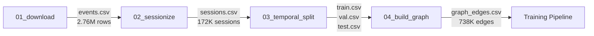
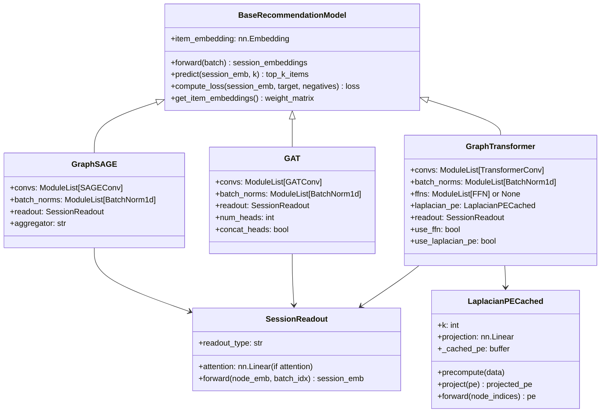
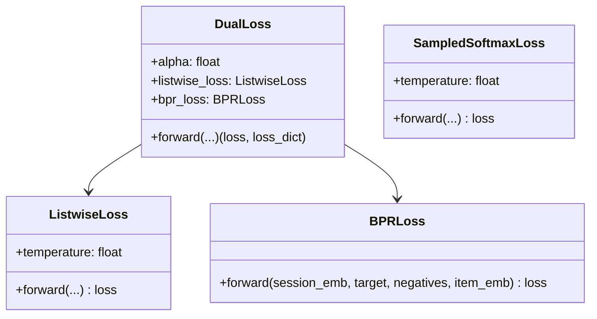
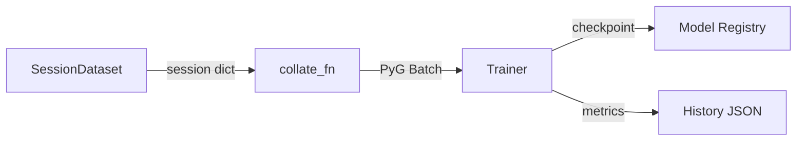

# C3: Component Diagram

This document zooms into each container and shows the internal components, their responsibilities, and how they connect.

## Data Pipeline Components



### 01_download_retailrocket.py

Downloads the RetailRocket dataset from Kaggle.

| Property | Value |
|----------|-------|
| Input | Kaggle API key |
| Output | `data/raw/events.csv` (2,756,102 rows) |
| Schema | `timestamp, visitorid, event, itemid, transactionid` |
| Events | view (94.4%), addtocart (5.8%), transaction (2.1%) |

### 02_sessionize.py

Groups raw events into browsing sessions.

| Property | Value |
|----------|-------|
| Input | `data/raw/events.csv` |
| Output | `data/interim/sessions.csv` (955,778 events, 172,066 sessions) |
| Metrics | `data/interim/session_stats.json` |
| Session gap | 30 minutes of inactivity |
| Min session length | 3 events |
| Added column | `session_id` |

**Logic:** Sort events by visitor and timestamp. If the gap between consecutive events from the same visitor exceeds 30 minutes, start a new session. Drop sessions with fewer than 3 events.

### 03_temporal_split.py

Splits sessions into train/val/test by time, not randomly.

| Property | Value |
|----------|-------|
| Input | `data/interim/sessions.csv` |
| Output | `data/processed/train.csv`, `val.csv`, `test.csv` |
| Metrics | `data/processed/split_info.json` |
| Split ratio | 70% train / 15% val / 15% test |
| Blackout period | 1-3 days between splits |

**Logic:** Sort sessions by start time. Take the first 70% for training, next 15% for validation, last 15% for test. Insert 2-day blackout periods between splits. Sessions that span a blackout boundary are dropped.

**Split result:**
| Split | Sessions | Events |
|-------|----------|--------|
| Train | 120,436 | 679,365 |
| Val | 23,861 | 127,461 |
| Test | 23,408 | 125,363 |
| Dropped (blackout) | 4,361 | - |

### 04_build_graph.py

Builds a co-occurrence graph from training sessions.

| Property | Value |
|----------|-------|
| Input | `data/processed/train.csv` |
| Output | `data/processed/graph_edges.csv` (737,716 edges) |
| Metrics | `data/processed/graph_stats.json` |
| Co-occurrence window | plus/minus 5 steps |
| Edge type | Undirected, weighted |

**Logic:** For each session, iterate over item pairs within a window of 5 steps. Create an edge between them (or increment the count if the edge already exists). Track event pair types (view-view, view-addtocart, etc.) and last timestamp.

**Graph properties:**
| Property | Value |
|----------|-------|
| Nodes (items) | 82,173 |
| Edges | 737,716 |
| Average degree | 17.96 |
| Edge count mean | 2.40 |
| Edge count median | 1.0 |
| Max edge count | 1,424 |

---

## Model Components



### BaseRecommendationModel (`etpgt/model/base.py`)

Abstract base class for all models. Provides:
- **Item embedding layer:** `nn.Embedding(num_items, 256)` with Xavier initialization. Index 0 is padding.
- **predict():** Dot product between session embeddings and all item embeddings, return top-K.
- **compute_loss():** Default BPR loss. Custom losses can override this.

### SessionReadout (`etpgt/model/base.py`)

Aggregates node embeddings from a session subgraph into a single session vector.

| Readout Type | How It Works | When To Use |
|-------------|-------------|-------------|
| `mean` | Average all node embeddings | Default. Works well for most sessions. |
| `max` | Element-wise max across nodes | Emphasizes dominant features. |
| `last` | Take the last node's embedding | When recency matters most. |
| `attention` | Learned weighted average | When some items matter more than others. |

### LaplacianPECached (`etpgt/encodings/laplacian_pe.py`)

Computes positional encodings from the graph Laplacian's eigenvectors.

**What it does:** Gives every node a unique "fingerprint" based on its position in the global graph structure. Without this, nodes with identical local neighborhoods produce identical embeddings.

**How it works:**
1. Compute the symmetric normalized Laplacian: `L = D^(-1/2) (D - A) D^(-1/2)`
2. Compute the `k` smallest eigenvectors using `scipy.sparse.linalg.eigsh`
3. Skip the trivial first eigenvector (all ones)
4. Take absolute values (eigenvectors have arbitrary sign)
5. Project from `k` dimensions to `embedding_dim` via a learned linear layer
6. Add to item embeddings: `x = embedding + laplacian_pe`

**Parameters:**
| Parameter | Default | Purpose |
|-----------|---------|---------|
| `k` | 16 | Number of eigenvectors |
| `embedding_dim` | 256 | Output dimension after projection |
| `normalization` | `"sym"` | Symmetric Laplacian normalization |

---

## Loss Function Components



All loss functions in `etpgt/train/losses.py`:

| Loss | Formula | Purpose |
|------|---------|---------|
| **BPRLoss** | `-log(sigmoid(pos_score - neg_score))` | Pairwise ranking: push positive above negatives |
| **ListwiseLoss** | `cross_entropy(softmax([pos, neg_1, ..., neg_N]))` | Treat as classification: target is class 0 |
| **DualLoss** | `0.7 * listwise + 0.3 * bpr` | Combine both signals |
| **SampledSoftmaxLoss** | Same as ListwiseLoss | Alias for consistency |

---

## Training Components



### SessionDataset (`etpgt/train/dataloader.py`)

Loads sessions and creates training samples.

**For each session:**
1. Sort events by timestamp
2. Truncate to max 50 items (keep last N)
3. Target = last item
4. Context = all items except last
5. Sample 5 random negative items (not in session)
6. Extract session subgraph: edges from the global graph where both endpoints are in the context

**Returns per sample:**
```python
{
    "session_items": [item_1, item_2, ..., item_N-1],  # context
    "target_item": item_N,                              # what to predict
    "negative_items": [neg_1, ..., neg_5],              # random non-session items
    "edge_index": [[src_1, src_2, ...], [dst_1, dst_2, ...]]  # subgraph edges
}
```

### collate_fn (`etpgt/train/dataloader.py`)

Converts a list of session dicts into a PyG Batch:
1. For each session, find unique items and create a local index mapping (global item ID to local 0, 1, 2, ...)
2. Remap edge_index to local coordinates
3. Create a `Data(x=unique_items, edge_index=local_edges, target_item=..., negative_items=...)`
4. Call `Batch.from_data_list()` to merge all Data objects into one batch

### Trainer (`etpgt/train/trainer.py`)

Standard training loop:
1. **train_epoch():** Forward pass, compute loss, backward, optimize. Returns average loss.
2. **evaluate():** Forward pass on validation set, compute Recall@K and NDCG@K.
3. **train():** Loop over epochs. Evaluate every `eval_every` epochs. Save best checkpoint. Early stop after `patience` epochs without improvement.

**Key parameters:**
| Parameter | Default | Purpose |
|-----------|---------|---------|
| `max_epochs` | 100 | Maximum training epochs |
| `patience` | 10 | Early stopping patience |
| `eval_every` | 1 | Evaluate every N epochs |
| `k_values` | [10, 20] | K values for Recall@K and NDCG@K |

---

## Serving Components


### Inference Engine (`scripts/serve/vertex_app.py`)

Two modes:
- **PyTorch mode:** Load checkpoint, reconstruct model, extract embeddings
- **ONNX mode:** Load `session_recommender.onnx` + `item_embeddings.npy`

Both modes use the same inference logic:
```
session_embedding = mean(item_embeddings[session_items])
session_norm = L2_normalize(session_embedding)
scores = session_norm @ item_embeddings_norm.T
scores[session_items] = -inf  # exclude already-seen items
top_k = argsort(scores)[-k:]
```

### ONNX Export (`scripts/pipeline/export_onnx.py`)

Only the scoring layer is exported to ONNX (not the full GNN):
- Input: `session_embedding [batch_size, embedding_dim]`
- Output: `scores [batch_size, num_items]`
- Opset version: 14

The GNN forward pass has dynamic graph structure that ONNX cannot represent. At serving time, the GNN is not needed because item embeddings are pre-computed.

### Health and Monitoring

- `/health`: Returns model status, inference mode, num_items, embedding_dim
- `/metrics`: Prometheus counters and histograms
- `/drift`: Evidently-based drift detection on score distributions and session lengths
